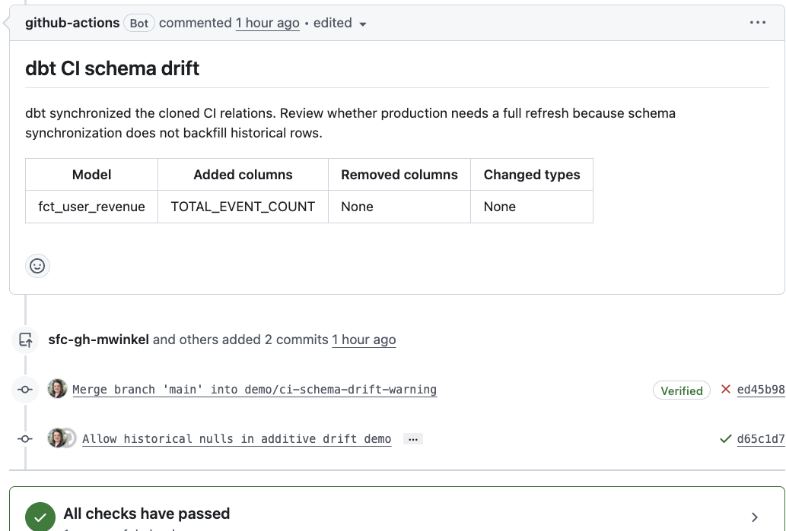

# Incremental Model Management in Slim CI

This guide covers only the incremental-model portion of the CI pattern: cloning the current production table, removing a controlled slice of cloned data, and running the changed model incrementally against that realistic starting state.

## Goal

A new PR schema normally has no target table. For an incremental model, that makes `is_incremental()` return false and CI performs a full build. That does not validate the code path production will use on its next run.

The implementation uses this sequence:

1. Download the manifest from the latest successful production run.
2. Use `dbt clone` to create the selected production incremental tables in the PR target.
3. Delete a recent, model-specific time window from each clone.
4. Run the normal slim-CI selection.
5. Let each model's incremental materialization process the missing window.

## Prerequisites

- A validated, pinned dbt dependency set. This repository uses dbt Core 1.9.4, dbt-snowflake 1.9.2, and dbt-adapters 1.16.3. Native `dbt clone` starts in dbt 1.6, but any internal macro override must be revalidated for the exact installed versions.
- A production job that publishes `target/manifest.json` after a successful run.
- A unique target schema or schema suffix for each PR.
- A CI role with read/clone access to production relations and create/modify access in CI schemas.
- Snowflake or another adapter with native zero-copy clone support. Do not use the destructive trim hook against pointer-view fallbacks.
- Incremental models with deterministic incremental predicates and stable unique keys.

## 1. Publish Production State

The production job must upload the manifest produced by the same code revision that built production:

```yaml
- name: dbt build (production)
  run: dbt build --target prod --profiles-dir ./profiles

- name: Upload production manifest
  uses: actions/upload-artifact@v4
  with:
    name: dbt-prod-manifest
    path: target/manifest.json
    retention-days: 90
    overwrite: true
```

Do not publish a manifest from a failed run. The manifest's relation metadata tells `dbt clone` where each production object exists.

## 2. Select and Clone Incremental Models

After downloading the production manifest, clone only incremental models in the slim-CI selection:

```yaml
- name: Clone modified incremental models
  if: ${{ hashFiles('prod-manifest/manifest.json') != '' }}
  run: |
    dbt clone \
      --select "state:modified+,config.materialized:incremental" \
      --state ./prod-manifest \
      --full-refresh \
      --target check \
      --profiles-dir ./profiles
```

The comma is an intersection: the selected resource must be both in `state:modified+` and configured as incremental.

### What `--full-refresh` Means Here

`dbt clone --full-refresh` does **not** run model SQL and does **not** perform a full dbt build. On the `clone` command, the flag means: recreate matching relations that already exist in the current CI target.

Without the flag, a retried or synchronized PR can keep an older clone because `dbt clone` skips pre-existing target relations. With the flag, dbt replaces the CI relation with a fresh clone of the relation recorded in the production manifest. On Snowflake this remains a metadata-based zero-copy clone operation.

This differs from `dbt build --full-refresh`. On `build` or `run`, the flag tells dbt to treat selected incremental models as table models and rebuild them by executing their full SQL.

## 3. Configure a Trim Watermark

Each incremental model needs a column that represents the model's incremental boundary:

```yaml
models:
  - name: fct_user_revenue
    meta:
      ci_trim_timestamp_column: last_event_at
      ci_trim_days: 1  # optional model override
```

Use the same business watermark used by the model's `is_incremental()` predicate. Do not default every model to a generic `updated_at` unless that column has the same semantics across the project.

Project defaults can be defined in `dbt_project.yml`:

```yaml
on-run-start:
  - "{{ clone_incrementals_for_ci() }}"

vars:
  ci_target_names: ['ci', 'pr', 'slim_ci', 'check']
  ci_trim_days: 1
  ci_timestamp_column: null
  ci_clone_enabled: true
```

Leaving the global timestamp column null forces each incremental model to declare its watermark explicitly.

## 4. Add the Trim Hook

Use an `on-run-start` macro that operates only in CI and only on selected incremental models. The production source resolution and clone operation should not be duplicated in this macro; `dbt clone` already owns those concerns.

The reference implementation is [`macros/hooks/clone_incrementals_for_ci.sql`](macros/hooks/clone_incrementals_for_ci.sql). Its important behaviors are:

- Read models from `selected_resources` so trimming matches the build selection.
- Resolve the CI relation from `node.database`, `node.schema`, and `node.alias` after dbt naming macros have run.
- Skip a model when no target relation exists. For new models, separately ensure a stale relation from an earlier revision cannot remain in a reused PR schema.
- Verify the resolved relation is a table before issuing `DELETE`; fail closed for views or unsupported relation types.
- Require a positive integer trim window and a valid timestamp column.
- Match configured column names case-insensitively, then quote the physical name returned by adapter introspection.
- Delete relative to `max(watermark)` in the clone, not `current_timestamp()`. This supports stale or fixture data.

The repository macro should be hardened with a relation-type check before client adoption. Treat a non-table relation as an error rather than attempting to trim it.

The deletion is equivalent to:

```sql
delete from <ci_clone>
where <watermark> >= dateadd(
    day,
    -<trim_days>,
    (select max(<watermark>) from <ci_clone>)
);
```

Choose a window wide enough to remove at least one model grain and to cover normal late-arriving data. Avoid trimming the entire table unless the model handles an empty target correctly.

This pattern validates replay of a recent high-watermark window. It does not prove that the model captures records arriving later with a watermark older than the retained maximum. If late-arriving data is a requirement, the model needs an explicit lookback, source update timestamp, or another change-detection strategy, plus a separate CI scenario for that behavior.

## 5. Make Empty-Target Logic Safe

An incremental predicate should not turn `max(watermark) is null` into an empty result. A safe pattern is:

```sql

where
    (select max(last_event_at) from {{ this }}) is null
    or last_event_at > (select max(last_event_at) from {{ this }})

```

Also review boundary semantics. If the trim hook deletes with `>=`, but the model reloads with `> max(remaining_watermark)`, rows tied exactly at the boundary will be reprocessed. Test duplicate-watermark cases with the model's `unique_key` and incremental strategy.

## 6. Handle Schema Changes Deliberately

The cloned table has the production schema while the PR's temporary relation has the proposed schema. dbt can compare these at incremental runtime:

```sql
{{
    config(
        materialized='incremental',
        unique_key='user_id',
        on_schema_change='sync_all_columns'
    )
}}
```

Available policies are:

| Setting | Behavior |
|---|---|
| `ignore` | Keep the existing target schema. New model columns may not land. |
| `fail` | Stop when source and target schemas differ. |
| `append_new_columns` | Add new columns but retain removed target columns. |
| `sync_all_columns` | Add and remove columns and attempt supported type changes. |

`sync_all_columns` validates that the proposed incremental SQL can run after schema synchronization, but it does not backfill newly added columns for historical rows outside the incremental window. A production full refresh or explicit backfill may still be required.

Do not infer the compiled output schema from `graph.nodes.columns`; that property represents declared YAML metadata and may be incomplete. dbt's runtime comparison between its temporary relation and cloned target is the accurate point to detect drift.

## 7. Run the Slim Build

After cloning, run the same selection with state deferral:

```yaml
- name: dbt build (slim CI)
  run: |
    dbt build \
      --select state:modified+ \
      --defer \
      --state ./prod-manifest \
      --target check \
      --profiles-dir ./profiles
```

The cloned relation makes `is_incremental()` true. The trim hook creates a known gap, and the build fills that gap using the PR's incremental logic.

## 8. Adoption Checklist

Before enabling this in a client repository:

- Inventory incremental models and their strategies, unique keys, and watermark predicates.
- Add `ci_trim_timestamp_column` to each model intended for clone-based CI.
- Confirm the trim boundary and model predicate reload the same rows.
- Confirm the production manifest contains correct production database, schema, and identifier values.
- Verify custom `generate_database_name` and `generate_schema_name` macros place clones in isolated PR schemas.
- Decide whether schema drift should fail CI or synchronize with a production-refresh warning.
- Test additive, removed-column, compatible type-change, empty-target, and no-drift scenarios.
- Test a second run of the same PR to prove `dbt clone --full-refresh` replaces the prior clone.
- Validate that new incremental models with no production relation take the normal first-build path, including after a previous revision created a relation at the same PR target location.

## 9. Recommended Rollout

Start with one representative incremental model. Run a control PR with no schema change, then an additive-column PR. Inspect the clone step, trim log, model row counts, and historical null behavior. Expand model coverage only after the boundary and backfill semantics are understood.

Keep clone freshness separate from production backfill decisions:

- `dbt clone --full-refresh`: refreshes the **CI clone** from production state.
- `dbt build`: runs the selected PR models and tests.
- `dbt build --full-refresh --select <model>`: rebuilds the **model data** from scratch and should be an explicit production operation.

## Appendix A. Complete dbt Command Order

The commands below show the complete order for production-state publication and a later PR validation run. Replace target names and artifact paths to match the client repository.

### Production Job

Run production first and publish the manifest only after the build succeeds:

```bash
# 1. Install project packages.
dbt deps --profiles-dir ./profiles

# 2. Load seeds if they are part of the production workflow.
dbt seed \
  --target prod \
  --profiles-dir ./profiles

# 3. Build production models and tests.
dbt build \
  --target prod \
  --profiles-dir ./profiles

# 4. Publish target/manifest.json as the production-state artifact.
```

If the client separates execution and testing, steps 2 and 3 can instead use `dbt run` followed by `dbt test`. The uploaded manifest must come from the successful production invocation and must not be overwritten by later CI commands.

### Pull Request Job

Download the production manifest to `./prod-manifest/manifest.json`, then run:

```bash
# 1. Install exactly the dependencies pinned by the project.
dbt deps --profiles-dir ./profiles

# 2. Load CI-specific seeds before source tests or models reference them.
dbt seed \
  --target check \
  --profiles-dir ./profiles

# 3. Recreate selected incremental targets from fresh production clones.
dbt clone \
  --select "state:modified+,config.materialized:incremental" \
  --state ./prod-manifest \
  --full-refresh \
  --target check \
  --profiles-dir ./profiles

# 4. Run modified models, their descendants, and selected tests.
#    The on-run-start trim hook runs at the start of this command.
dbt build \
  --select state:modified+ \
  --defer \
  --state ./prod-manifest \
  --target check \
  --profiles-dir ./profiles
```

The order is significant:

1. The manifest must exist before selection and cloning.
2. `dbt clone` must run before `dbt build` so `is_incremental()` sees an existing relation.
3. The trim hook must run after cloning and before model execution. In this implementation, `on-run-start` supplies that ordering within `dbt build`.
4. Do not pass `--full-refresh` to the CI `dbt build`; that would bypass incremental execution.

For a new incremental model with no production relation, `dbt clone` has nothing to clone. Prefer newly created, isolated PR schemas. If a PR schema can be reused across revisions, add a pre-build cleanup that identifies `state:new` incremental models and drops only their existing CI-target relations before the clone/build sequence. Do not rely on `dbt clone --full-refresh` to remove those stale targets; it can recreate a target only when a source relation exists in production state.

## Appendix B. Add a Full-Refresh Advisory to the GitHub PR

This appendix describes a non-failing advisory for models using `append_new_columns` or `sync_all_columns`. CI synchronizes the cloned relation, keeps the check green, and tells the reviewer that production may require a targeted full refresh or backfill. With `on_schema_change: ignore`, dbt performs no comparison and there is nothing to report. With `on_schema_change: fail`, drift correctly fails the build rather than producing a non-failing advisory.

### 1. Capture dbt's Runtime Schema Comparison

The accurate detection point is dbt's incremental materialization, after it has built the temporary relation from the proposed model SQL. A project-level wrapper around `process_schema_changes` can reuse dbt's native comparison and emit one structured log record when drift exists:

```jinja

    
    
        
    
    {{ return(names) }}



    
        {{ return({}) }}
    

    

    
        
            
            {{ log('DBT_CI_SCHEMA_DRIFT ' ~ tojson(finding), info=true) }}
        

        
            
        
            
        
    

    {{ return(changes['source_columns']) }}

```

This is an internal dbt macro override. Copy the full implementation from the exact pinned `dbt-adapters` version, add only the reporting behavior, and review it whenever dbt is upgraded. The complete pinned example in this repository is [`macros/materializations/ci_schema_change_report.sql`](macros/materializations/ci_schema_change_report.sql).

### 2. Convert the Finding into a GitHub Report

After `dbt build`, run an `always()` step that parses `logs/dbt.log`, extracts `DBT_CI_SCHEMA_DRIFT` JSON records, and writes:

- A GitHub warning annotation using `::warning::...`.
- A Markdown report file such as `schema-drift-report.md`.
- The same Markdown to `$GITHUB_STEP_SUMMARY`.

The report should state that `sync_all_columns` changed the CI clone but did not backfill untouched historical rows. Include the affected model and the added, removed, and type-changed columns. Save the following as `.github/scripts/render_schema_drift.py`:

```python
import json
import os
from pathlib import Path


MARKER = "DBT_CI_SCHEMA_DRIFT "
LOG_PATH = Path(os.environ.get("DBT_LOG_PATH", "logs")) / "dbt.log"
REPORT_PATH = Path("schema-drift-report.md")


def escape_workflow_command(value):
    return str(value).replace("%", "%25").replace("\r", "%0D").replace("\n", "%0A")


def markdown_cell(value):
    return str(value).replace("|", "\\|").replace("\n", " ")


def display_list(values):
    if not values:
        return "None"
    return ", ".join(str(value) for value in values)


def read_findings():
    if not LOG_PATH.exists():
        return []

    findings = []
    seen = set()
    for line in LOG_PATH.read_text(encoding="utf-8", errors="replace").splitlines():
        marker_position = line.find(MARKER)
        if marker_position == -1:
            continue
        payload = line[marker_position + len(MARKER) :]
        try:
            finding = json.loads(payload)
        except json.JSONDecodeError:
            continue
        identity = finding.get("relation") or finding.get("model")
        if identity not in seen:
            findings.append(finding)
            seen.add(identity)
    return findings


def render(findings, build_outcome):
    lines = ["<!-- dbt-ci-schema-drift -->", "## dbt CI schema drift"]
    if not findings:
        if build_outcome == "success":
            status = "No incremental model schema drift was detected."
        else:
            status = "Schema drift could not be fully evaluated because the dbt build did not succeed."
        lines.extend(["", status])
        return "\n".join(lines) + "\n"

    lines.extend(
        [
            "",
            "dbt synchronized the cloned CI relations. Review whether production needs a full refresh because schema synchronization does not backfill historical rows.",
            "",
            "| Model | Added columns | Removed columns | Changed types |",
            "|---|---|---|---|",
        ]
    )
    for finding in findings:
        lines.append(
            "| {model} | {added} | {removed} | {changed} |".format(
                model=markdown_cell(finding.get("model", finding.get("relation", "Unknown"))),
                added=markdown_cell(display_list(finding.get("added_columns", []))),
                removed=markdown_cell(display_list(finding.get("removed_columns", []))),
                changed=markdown_cell(display_list(finding.get("changed_types", []))),
            )
        )
    return "\n".join(lines) + "\n"


findings = read_findings()
report = render(findings, os.environ.get("DBT_BUILD_OUTCOME", "unknown"))
REPORT_PATH.write_text(report, encoding="utf-8")

summary_path = os.environ.get("GITHUB_STEP_SUMMARY")
if summary_path:
    with open(summary_path, "a", encoding="utf-8") as summary:
        summary.write(report)

for finding in findings:
    message = "Schema drift in {model}: added [{added}], removed [{removed}], changed types [{changed}]. Production may require a full refresh.".format(
        model=finding.get("model", finding.get("relation", "unknown model")),
        added=display_list(finding.get("added_columns", [])),
        removed=display_list(finding.get("removed_columns", [])),
        changed=display_list(finding.get("changed_types", [])),
    )
    print(f"::warning::{escape_workflow_command(message)}")

github_output = os.environ.get("GITHUB_OUTPUT")
if github_output:
    with open(github_output, "a", encoding="utf-8") as output:
        output.write(f"has_drift={'true' if findings else 'false'}\n")
```

This is the complete reference implementation from [`.github/scripts/render_schema_drift.py`](.github/scripts/render_schema_drift.py).

### 3. Create or Update One PR Comment

Grant the workflow only the required permissions:

```yaml
permissions:
  actions: read
  contents: read
  pull-requests: write
```

Then add the reporting steps after `dbt build`:

```yaml
- name: Render schema drift report
  id: schema-drift
  if: ${{ always() }}
  env:
    DBT_BUILD_OUTCOME: ${{ steps.dbt-build.outcome }}
    DBT_LOG_PATH: logs
  run: python .github/scripts/render_schema_drift.py

- name: Update schema drift PR comment
  if: ${{ always() && github.event.pull_request.head.repo.full_name == github.repository }}
  env:
    GH_TOKEN: ${{ github.token }}
    PR_NUMBER: ${{ github.event.pull_request.number }}
  run: python .github/scripts/update_schema_drift_comment.py
```

Use a stable hidden marker in the generated Markdown:

```markdown
<!-- dbt-ci-schema-drift -->
## dbt CI schema drift
```

The comment script should search for a comment that contains the marker **and** was authored by the expected GitHub Actions bot or application. `PATCH` that bot-owned comment; otherwise `POST` a new comment. Checking ownership prevents a user-authored comment containing the marker from being overwritten. This avoids adding a new comment every time the PR is synchronized. The reference implementation is [`.github/scripts/update_schema_drift_comment.py`](.github/scripts/update_schema_drift_comment.py); harden its lookup with the ownership check before client adoption.

Keep the workflow on the `pull_request` event. Do not use `pull_request_target` to check out and execute untrusted PR code with a privileged token. The same-repository condition above skips comments for fork PRs, where the token is normally read-only; warning annotations and job summaries can still be produced.

### 4. Recommended PR Message

The advisory should be explicit but should not claim that every schema change requires a full refresh:

> dbt synchronized the cloned CI relation. Review whether production needs a targeted full refresh or backfill because schema synchronization does not populate newly added or changed fields for historical rows outside the incremental window.

If the team decides a refresh is required, the production action remains separate and explicit:

```bash
dbt build \
  --full-refresh \
  --select <incremental_model>+ \
  --target prod \
  --profiles-dir ./profiles
```

The trailing `+` includes downstream models and tests so they are rebuilt or validated against the refreshed model. For a large downstream graph, the release owner can instead refresh only the incremental model and run a separately reviewed downstream selection.

Do not execute that production command automatically from an unreviewed PR. The comment is a deployment instruction for the owner of the production release process.

